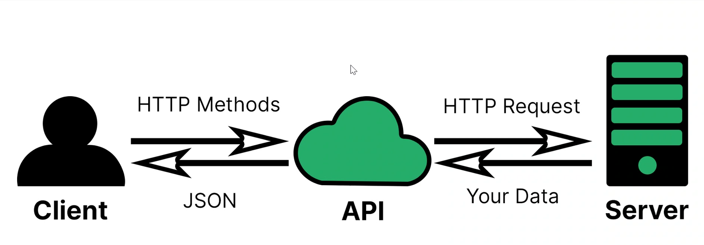

## API's

### What is an API?

A = Application

P = Program

I = Interface

A way to transfer data from a separate server or service (independent of the languages involved)

### How does it work?

We use HTTP Methods to connect with an API, the API makes it so people don't have to use the same format or language to make a request from this server. 
The API translates this and sends a request to the server. The server sent back the request in the form of data to the API. The API translates this again to send back a JSON file to us

### What is REST API?

RE = Representational

S = State

T = Transfer

REST API's are lightweight, maintainable and scalable because they follow the REST principles. 

#### What makes an API RESTful?

- Representational data flow
- Messages
- Unique URI's/naming
- Statelessness
- Caching

### HTTP Messages/Verbs

HTTP protocol for messaging over the internet, it works with a request/response system.

#### Request

Verb - What do you want to do

URL - Where am I sending the request

Version - Manage the version, any changes to the API

Verb = Get
URL = http://example.com 1.1
Header = Content-Type : application/json

Body= No Body required because not sending, only requesting.

#### Response

Responses will come as JSON

### 5 HTTP Verbs, what do they do?

- **GET**: Used to retrieve information from the server.
- **POST**: Used to send data to the server to be processed. Similar to submitting a form on a website.
- **PUT**: Used to update exist data on the server.
- **DELETE**: Used to delete data from the server.
- **PATCH**: Used to make partial updates to exist data on the server, similar to put but instead of sending the entire updated source, only some needed changes are made. 

### What is statelessness?

Statelessness means that the server does not store any information about the user in between requests, each request contains all the necessary information for the server to fulfill it. 

This makes it: 
- Simple
- Scalable
- Reliable

You can maintain stateless architecture but enable stateful interactions using tokens or cookies. 

### What is caching?

Caching in means storing frequently accessed data or resources on the client-side or server-side to reduce the number of requests required to load a page or perform an operation.

This is great because: 
- Better speed
- Reduced network traffic
- Better performance

Though unfortunately: 
- Worse data consistency 
- Tough storage management 

